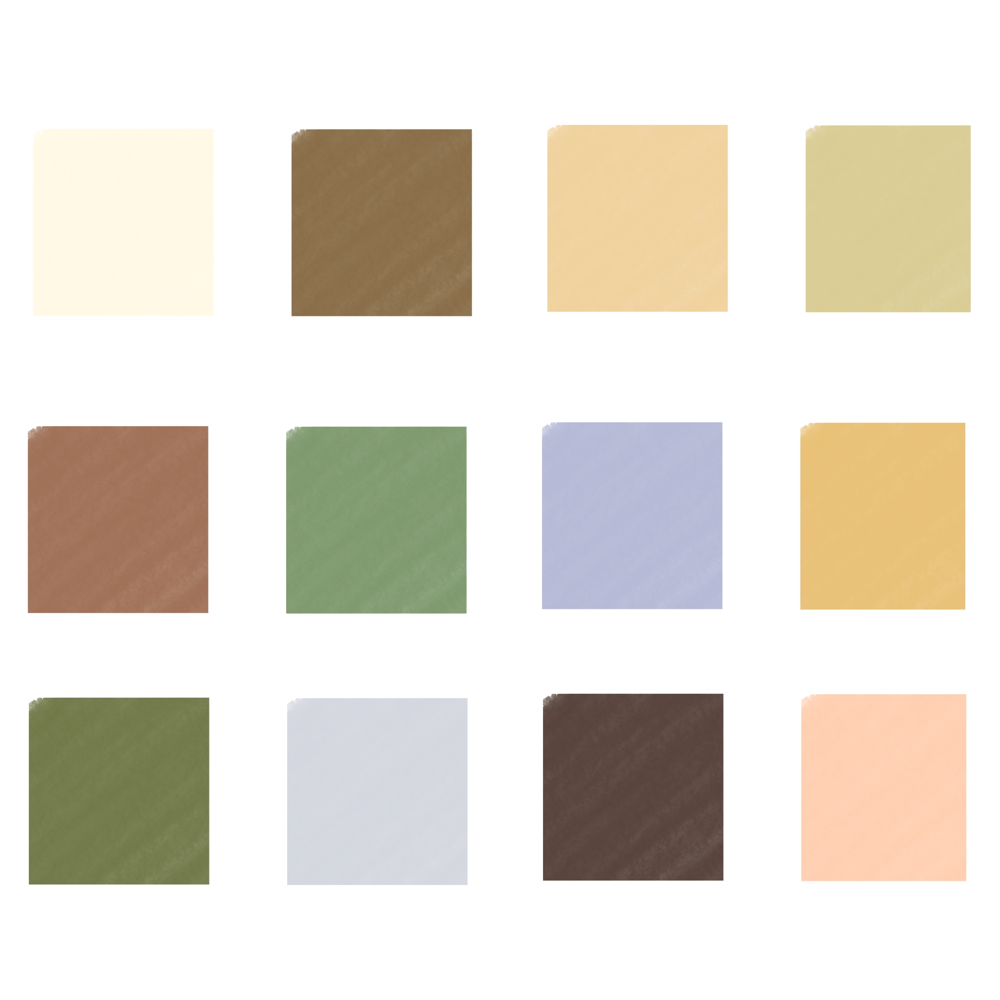
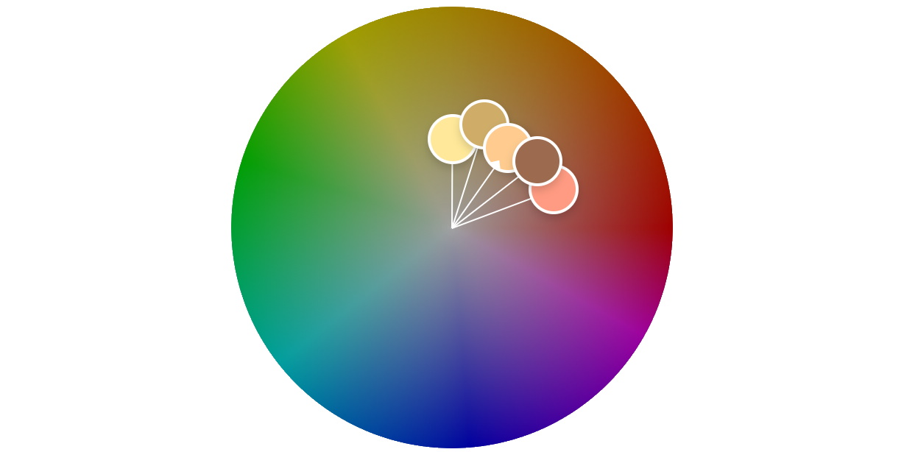
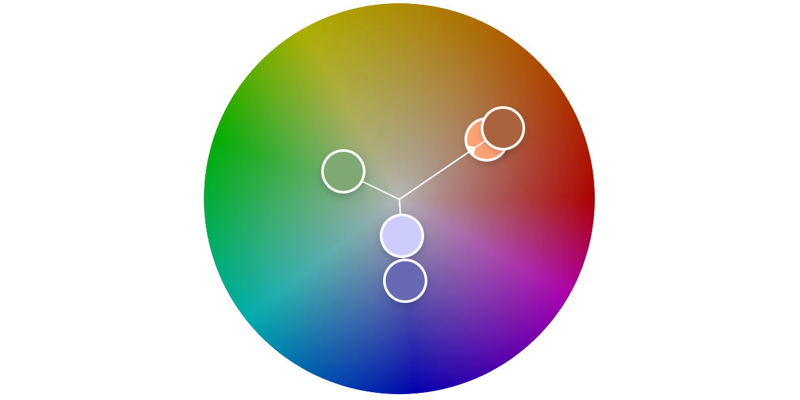

For years in the general fashion world, black and white have been a brilliant go to. They're an absolute staple of the industry, being a very clear usage of sophisticated and constrating clothing. However at some point during 2016 or 2017, something changed. A new wave of colour combinations had really taken a hold of the scene, with the likes of Kanye West emploring it in his line of Yeezy season 3 clothing collection. Said wave of colour was "**Earth tones**".

But what are earth tones? What do they look like? Why did they pick up in the first place? And how can you find pieces that fit the earth tone aesthetic? Let's take a look.

## Earth tones - what are they?

Well, it's kind of in the name. Earth tones are colours that we would see *in the natural earth*. This could be as simple as the browns in the soil, to something less obvious like the clear blues of the waters (as opposed to deep blues). In earth tones as a whole, *there are lots of browns and beiges*. So, let me drop you a grid like I did with the last fashion article and show you what sort of colours we mean.

There's a lot of interesting colours to choose from, that can make for a real treat in our wardrobe. And these muted shades can be combined and used as if they were as basic as black and white combos.
For example, you could have a light sandy coloured top and dark brown bottoms instead of a white tee and black bottons. This offers more complexity as not only are we changing the contrast drastically, we are also adding a slight change in tone - providing an overall difference in our layers. As well, these base browns and beiges work well with our other muted colours within the scheme. For example, a pair of dark brown bottoms and a muted pink top absolutely **slaps!**

But for a moment, I want do something that'll make this blog article a little more unique than others. *Why do earth tones work?* I've got a theory or two, if you'll endulge me.

### Why do earth tones work? - the theory

As a part of doing this web development, I deal quite a bit with colour theory. I use the concepts I learn in colour theory between both fashion and web development, to consolidate an accurate understanding of the concept as a whole. That and I used to do some digital art. With all that in mind, to my little "theory"...

If we were to draw a person - regardless of your skin colour. What hue would you pick for the skin colour? Typically, it'd be anywhere between the pink and yellow hues (Unless you're [Violet Beauregarde from Charlie and the Chocolate factory](https://roalddahl.fandom.com/wiki/Violet_Beauregarde)). Brown and beige tones are also conveniently within this scope, which means they work very well as complimentary tones for our skin. We could consider this palette of our skin and these two tones as an **analogous** palette (Colours that are in close proximity to each other on the wheel).

How about those other, more constrating colours then? Such as the grassy green, and the clear blue? Well, these can be chalked up to being more **triad** colours in relation to our skin colour range we mentioned earlier (Colours on the wheel that create more of a triangular shape).

So there's my theory about it. But can we get some examples on it?

**Sure! Let's do that right now!**

### How to do it

There's no *set* method of doing it, like there's no set ruleset on fashion - only some guidelines and examples that can help you do it "*better*".

Essentially, just using this pallete in conjunction with regular [colour theory](https://www.blog.tonycre8.co.uk/fashion-sense-colour/) and fashion concepts. However, it seems as if the earth tone style works much better with more faded colours and well, faded clothing. Rips and oversized clothing are a brilliant go to with this style, as it keeps you're silhouette interesting whilst providing a rugged, toned down look.

Let's quickly take a look at an example of someone who had quite the influence on this scene. The one and only...

#### Y E E Z U S (aka Kanye West)

We can't talk about earth tones without discussing the envisionary genius, Kanye West. Yes that's right, I called him a genius. Kanye West released a line to his famous clothing brand - Yeezy, that included earth tones. Yeezy season 3 especially, focussed heavily on earth tones, and other seasons of his line have continued to carry earth tones along with them.

As well as this, Kanye has added shoes to his Yeezy line that have carried more earth tones. For example the Yeezy 350 have an earth colourway. In addition, the Yeezy 500 have had the stone, supermoon yellow, and blush colourways that are all off-white tones. There's also the Yeezy 700 Mauve, which is a dark brown colour and includes some hint of lime green.

## Wrapping up

Earth tones are a very neat way to change up your outfit. Although it was a trend from a few years ago, we can still use it today as a way to spice up the contrast and tone of our wardrobe.

Also, as an update to my blogging situation, my blogs will be a little more sparadic now. I'm trying to rearrange my schedule again to fit in time to write blog articles (since I have so much time at home). However, my shift pattern at work has changed again. Thus, I'll let you know of the definitive upload time when I can. 