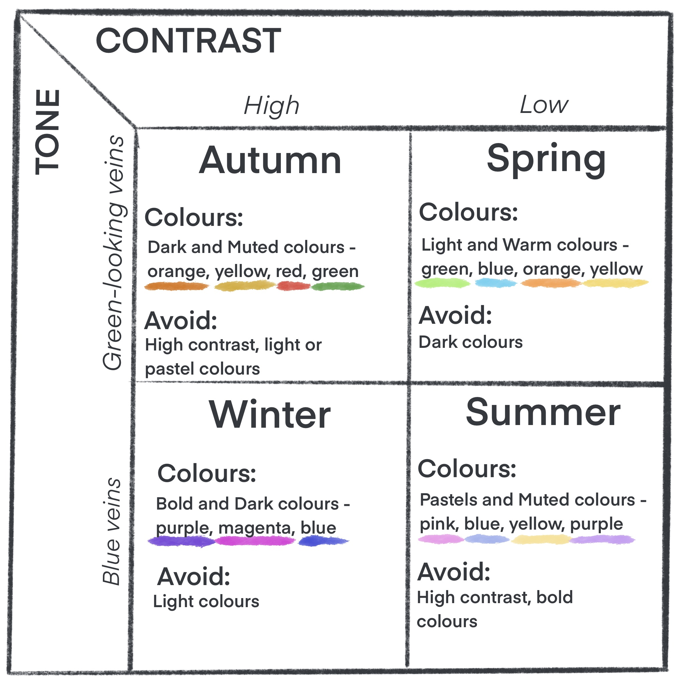
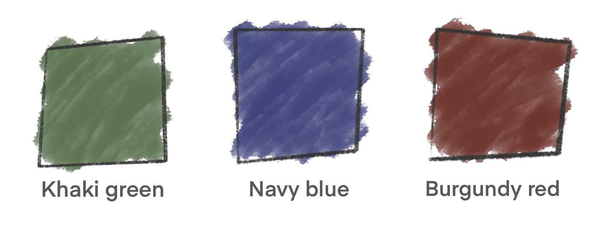
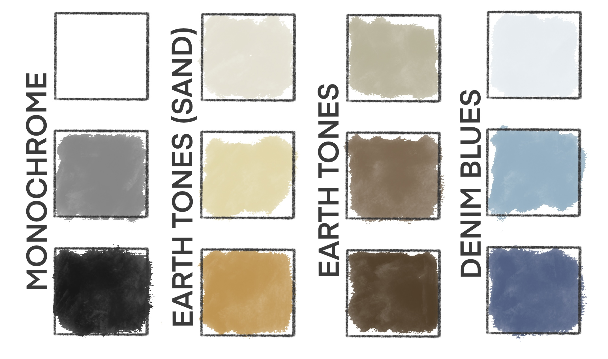
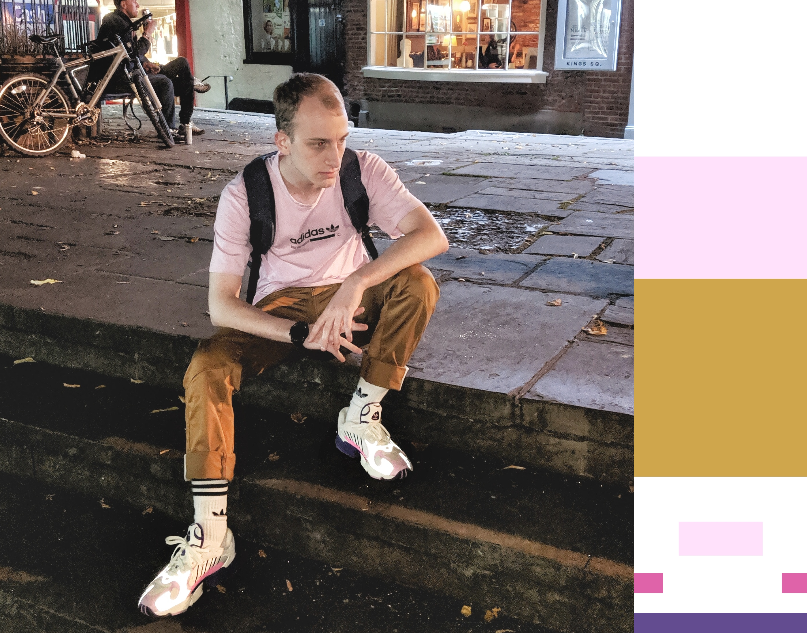
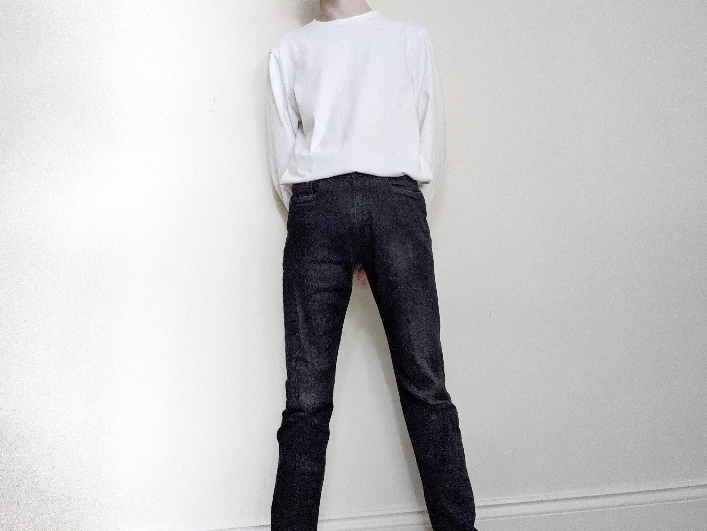
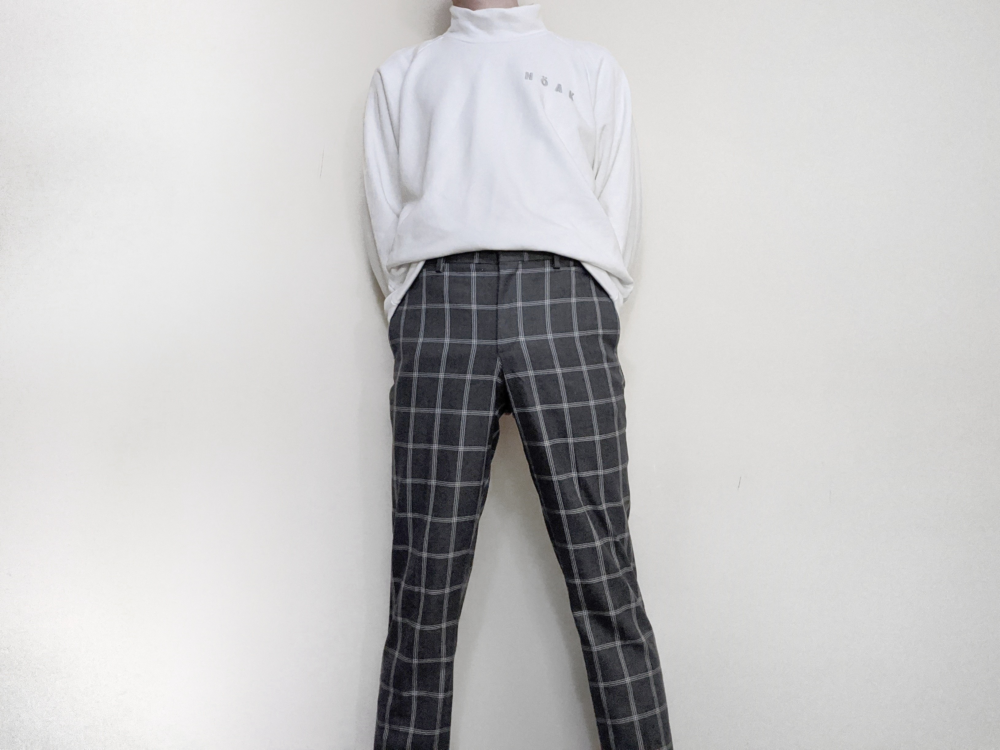
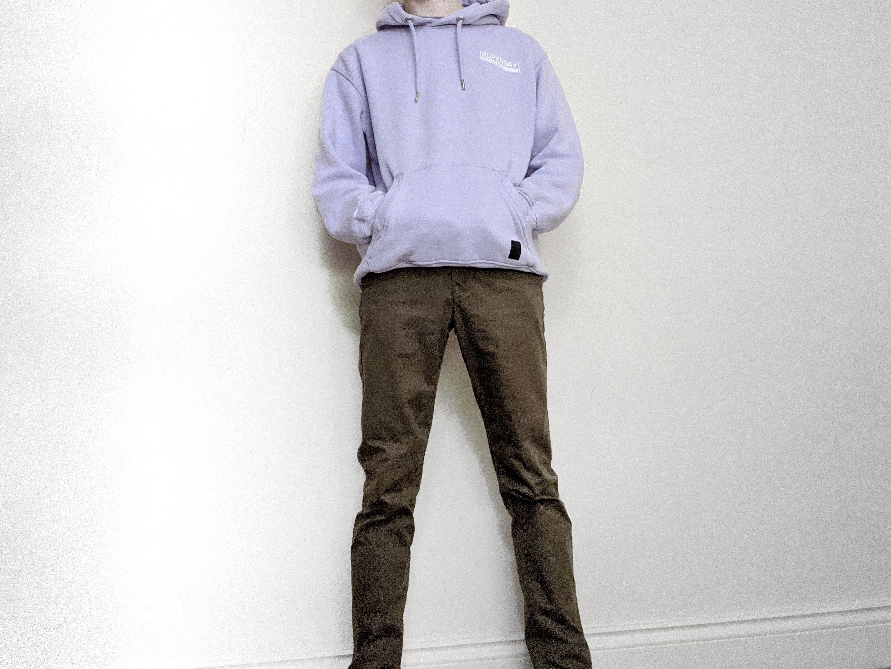
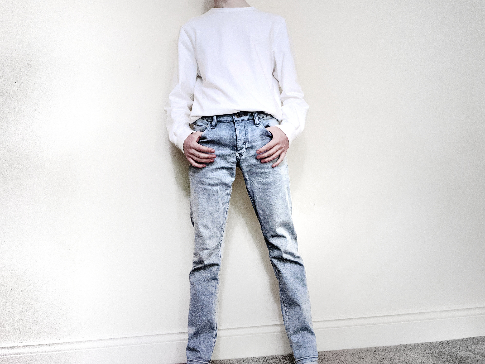
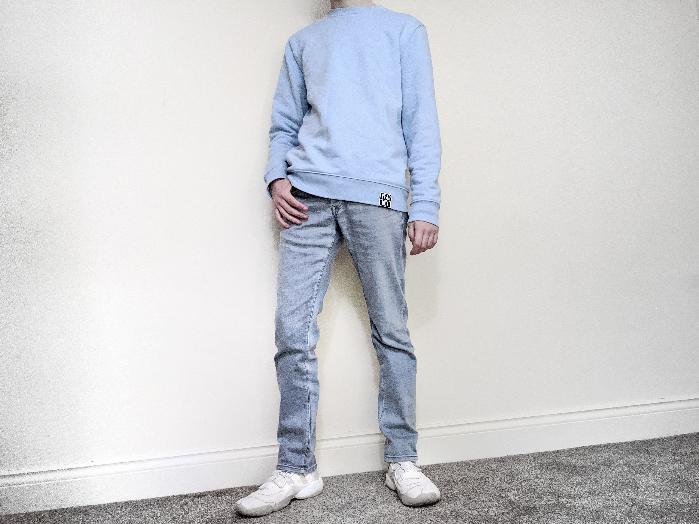

I've been busy and on holiday since my last article (and yes, I did indeed enjoy myself)! And so, what do we talk about today? Web Theories? ReactJS learning? Pfft, nope. It's fashion time!

If you were unaware (more than likely you were), I've been quite invested in fashion for the last few years. Why? Good question, I think it comes from my desire to look more approachable and/or to make myself look better as a whole. It was when I was studying at college I developed the passion, whilst all of my collueges were rocking their finest slacks (and I don't blame them, all things considered).

Because I was in college, I was used to writing essays. Thus, when I started learning about the quirks and theory of fashion, I decided to collate my research and start writing it up into an ebook of sorts. It never got finished mind you, but it had a lot going for it I thought. Now I have to stress before I start offering advice, that I'm not a professional fashionista. I'm just a guy with too much time, so view my takes as "opinionated" and "non-factual". Take them into consideration, as fashion (like art) is a subjective topic.

So with that, what do we talk about? How about a quick post on how to up your dress sense? Maybe this'll be a series, maybe it won't but we'll see how it goes!

# So how do we do it?

Upping our dress sense needs a little knowledge and work. We'll start with some basics, as we probably won't be able to cover everything in this one article. However even this one article, if applied, should make a positive impact to your appearance and attire. There's one area that I always notice that is usually ignored or unknown (especially in my area), and said area is **colour**. I'm not saying there's anything wrong with black and white, or plain outfits - not at all. I'm just saying that *you could try a little harder*. So let's begin to break down how we could dress better, starting with colour.

## Colour

Now when I was researching this information a while back, I frequented a source that was targeted towards women. However, that doesn't mean that guys should look away from these sources - these were an absolute treasure trove for me amongst others. There's one or two things we have to figure out about colour first before we can put it into an outfit of ours. This article is going to start from the top, i.e. main colours, and then it's going to descend into selective neutrals, before finally making it down to neutrals (what most people stick to today).

### Main colours - What suits you?

We'll start off with the exciting stuff then, figuring out what main colours suit us. Now, **there's no exact science to this**, you just have to trust your gut feelings. There's a couple of things we can do to work out what colours would theoretically work well on us. We can determine these by working out two key components of ourselves - tone and contrast. We'll start with contrast because it's the easiest for us to figure out.

#### Contrast

To determine our level of contrast, take a look at your face in the mirror; **What's the contrast between your face and your hair?** Is there a high contrast in colour? Is there a low contrast in colour?

As an example, you might be a pale skinned individual with light blonde hair, you could then think of yourself having a low contrast combination. Another could be if you had pale skin, but then dark hair, perhaps then you would consider yourself as having a high contrast combination. Like we said before though, this is a decision based on your perception, and I'll get more into why your perception is important later.

> Helpful tip: If you're unsure about your skin and hair difference, you can fall back on the contrast between your skin and your eyes instead.

Essentially, what you need to carry over from this area is this: Do you have a **high contrast** between your skin and hair, or do you have a **low contrast** between your skin and hair?
#### Tone

Figuring out tone is a little trickier. Well, it's not trickier really, it's just a tad more confusing.

Essentially, you need to work out whether your veins in your arm *appear* blue or green.

> **BIG NOTE:** your veins aren't actually green, it's just the pigments in your skin giving them the *appearance* that they are indeed, green. They'll always be blue, unless you have something wrong with your veins of course (in which case, my bad).

Take a look and see how they appear. If you can't see them in your arm, maybe try your hand. If you can't see them at all (maybe because of skin pigments), you essentially have free reign over where you place yourself in this category. 

So to carry over from here: Do your veins appear **blue**, or do they have a **green** tinge?

#### Ta-da! The colour guide graph

With the two aspects we discussed in mind, we'll look at a graph I made in line with the research I compiled. This is a helpful guide that combines the two and allows you to see what colours would *theoretically* work with your skin, including what you should avoid. So without further adieu, here it is:

Wow, very cool isn't it? This is still just a guide on some colours you can use to spruce your outfits up. But the main take from this is just to try it, experiment with these options and see what you like and think looks good on you - it's all up to your perception. For example, when I initially ran this test on myself, I came up as a Autumn kind of person. However when trying some of those colours on, it didn't suit me and I didn't like it. So I tried a more Summer palette instead, and it worked wonders for me.

Now, with that out of the way, let's quickly cover selective neutrals.

### Selective neutrals - The odd three

Selective neutrals are very much a grey area of "Does it work? Does it not?" It entirely depends on the outfit you're running, and the colours you're running along with that. But what could we consider as "selective neutrals"? Well, here I have yet **another graph**. Aren't I just the most useful person around?

What do you notice about these three? That's it, they're all primary colours (if your primary colours are on the RGB scale).

Now like I said, these colours depend on the other parts of your outfit. For example if you're wearing a colour like blue, it's probably best that you wear something to contrast it such as khaki green. However if you're going for a lower contrast fit at that point, you could get away with navy. You'll see an example like this later in the article.

### Neutrals - The basics!

Neutrals are what you'd expect they'd be. They are the plain colours that we can use to compliment or even make our outfit. I've got a little illustration to demonstrate what I mean down below.

As we can see here, these are a selection of colours that you see a lot of in outfits. In fact, it's very hard to find any of these colours *not* in an outfit out and about. These are great to help compliment your outfit, and to help balance out your colours. It can also be the thing that makes an outfit pop. I know I talked about how colour *makes* an outfit, but sometimes having lots of colour, and then contrasting it with something plain (like white) can absolutely bring your outfit up a couple notches.

## Colour blocking

We've discussed how to pick what colours we wear. Now we need to discuss how we put said colours together. For that, we need to talk about **Colour blocking**.

Colour blocking is essentially the build of an outfit purely in colours. Below I've got a picture that depicts an outfit being colour blocked.

It doesn't matter what detailing is on any of the items, we're just looking at main colours. It's kind of like if you were to take an incredibly low-resolution picture of your outfit - that's what colour blocking is.

But how do we apply it? Well there are two parts that will be familiar terms to you, but applied in different ways. Those terms are **contrast** and **tone** once again. Both of these are important, and can be used in combination to really make an outfit pop. So let's cover them.

> Another note: The images I'll show from here on out have been edited to show how the items *should* look in good lighting. 

### Contrast

Contrast in colour blocking is just working with the difference in *brightness* between parts of your outfit. A brilliant example of this is how basic fits are done (I know, those things I don't enjoy too much), the classic dark denim and white tee outfit is the most effective contrast you can get.

It's a very minimalist style, and is a good go-to for you if you're uncomfortable showing your colours at the moment.

### Tone

Tone then, with regards to colour blocking, is working with different shades. It's a more subtle part of contrasting your outfit. As an example, instead of having dark denim and a white tee, what about light grey denim and a white tee? The tone is more subtle, and it helps to build the complexion of your outfit. In the image below, I haven't used light grey jeans, but I can assure you the bottoms are lighter in real life than they look here.

However, at this point we've only talked about doing this in a monochrome sense. How about adding some of that colour we spent so long talking about?

### Reel it all in

To add colour to some of the examples we discussed earlier, we just need to add some **hue** in there. For example, we can contrast not only the brightness of parts of our outfit, but we can also contrast the hue. For example, what about a light purple top, and then a khaki green pair of bottoms? The image below isn't the best example, but it's a good example of clear contrast.

This outfit does demonstrate another concept though, that is also used in web design. Just some simple colour theory is all, using **complementary colours** in different shades. If you don't know about this, I'd suggest playing around with [this colour wheel](https://www.canva.com/colors/color-wheel/) to get an idea of different colour combinations and concepts.

Well what about tone then? Tone is also easily achievable if we just add some hue to what we've said already. As an example, instead of a white tee and some light grey jeans, how about a white tee and some light wash denim? It adds some blue to our outfit, and gives us a cool toned look.

Piling that all together then, we can talk about the part of an outfit I've avoided mentioning until this point - footwear. It's hard to think that I could go on so long without mentioning it, because I have a lot of shoes myself. How can we use footwear to assist in colour blocking our outfit? Easy, just do the same as we did before.

Let me give you an example that I'm liking recently. I've got a light blue sweatshirt, and a light wash pair of denim. It's a very subtle tone change, but it's definitely there. But how can we add some more noticeable contrast? White shoes!

White shoes are an essential part of **any** wardrobe. And if you haven't got any, you need to get some! It's a brilliant asset to help you contrast and tone your outfits. An example before from when we talked about monochrome outfits, is having a white top, dark denim bottoms, and then you guessed it - white shoes! It really helps to tie the outfit altogether.

This is just starting to cover the deep dive that is fashion concepts. Although we only discussed how we can make a difference with colour today, we may (if I decide to write more about it) discuss other ways we can improve our dress, such as layering, accessorising, and more!