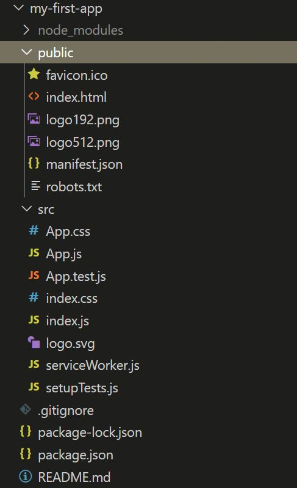
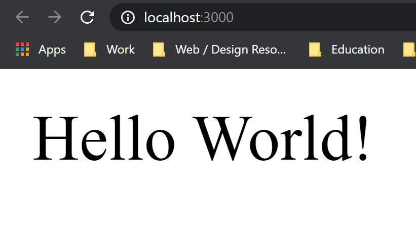

As a somewhat innexperienced individual in the world of web development, React always seemed like a huge giant looming over me. I'd never *dare* meddle with such a beast. But as the days turned into weeks, and weeks into months, I knew that I'd have to tango with it at some point.

I had just finished sorting this blog page out recently, as well as my [main wesbite](https://www.tonycre8.co.uk). With that all being set up, I had a little more free time to try something new. This blog runs on [GatsbyJS](https://www.gatsbyjs.org/) which uses [ReactJS](https://reactjs.org/), meaning that if I ever wanted to expand my blog, or I wanted to make changes to my main website, I'd have to dive into learning React.

I started out doing one or two starter projects this week so, I wanted to share with you the knowledge I've gathered (and keep it as a reminder for myself!) Also, consider this to be the start of somewhat of a series, as I won't be able to fit everything in this one article, and I'll be learning a lot more as time goes on!

# Starting up

Before we get started, let me mention a thing or two that may or may not be obvious by now. ReactJS uses JavaScript. Therefore it's probably good to have some JavaScript around your belt, or at least some programming experience and knowledge. HTML and CSS are sort of optional, but you will probably need to know at least of some basic markup and styling if you want to make your apps look nicer.

Starting up React isn't very complicated at all. Just ensure you have NodeJS installed, and then run the following command in the terminal of your preferred editor:
```
npx create-react-app my-first-app
```
That will set up everything you need to start building an app! Although you'll need to wait whilst it installs things, might be enough time to grab a drink. It'll include several files, folders and such. Your created folder should look something like this:



Starting out this can look like a huge mess, but once you know what things are and what they do, it becomes a bit easier to understand (and some of it becomes redundant).

**The public folder** doesn't have too much going on if you're making a basic app. React have some docs on [how to use the public folder](https://create-react-app.dev/docs/using-the-public-folder/). Although when you're starting out, you won't really ever touch it.

**The src folder** is the main folder we're interested in. It contains the source files for all of our work. When we boot our React project up, our work in this folder will be displayed to the user.

## The src folder and its contents

The first file we'll look at is **index.js**, which essentially renders your app as HTML. Essentially, think of it like a converter, that takes apart your app and makes it readable by a browser. Although, you could also work your app into this file, and render the App.js file non-essential. The [React tutorial for tictactoe](https://reactjs.org/tutorial/tutorial.html) has you do this. The index.css helps to style your page components, like you would for a regular HTML page.

Another file is the **serviceWorker.js**. It's not an essential file for your project, but it's good to know about. The serviceWorker works background processes, good for making things like pop-ups or background sync without a trigger.

The main file you'll be working with though (presumably) is the **App.js**. This is your main app, the one you'll more than likely start writing code in. The App.css then, is the styling for the components of your app. The **App.test.js** file allows us to write tests for our code to ensure that everything works as intended. Your App.js should look something like this when you open it up:

```jsx
import React from 'react';
import logo from '/logo.svg';
import './App.css';

function App() {
    return (
        <div className="App">
            <header className="App-header">
                
                <p>
                    Edit <code>src/App.js</code> and save to reload.
                </p>
                <a
                    className="App-link"
                    href="https://reactjs.org"
                    target="_blank"
                    rel="noopener noreferrer"
                >
                    Learn React
                </a>
            </header>
        </div>
    )
}
```

> Tip: If you're using VS Code like I am, you can get an extension called "VS Code ES7 React/Redux/React-Native/JS snippets".
>
> This extension means that you can quickly setup files like apps and components. If you make a file for a component or app, just type "rfc" inside it and press enter - magic!

Now this sounds all well and good, but what if we're trying to build a larger app? Well, that's when we can start creating **React components**.

### React components?

Indeed, a React component is essentially a unique component that we can reference and run. Think of it like a HTML element, but *custom*.
For example, let's start with a simple "Hello World" type piece of work.

```jsx
import HelloWorld from './components/HelloWorld';
// This import of HelloWorld allows us to grab a component
// We can then run that when we run the app, like so!
function App() {
    return (
        <>
            <HelloWorld />
        </>
    )
}
```

That <HelloWorld /> tag looks like HTML but it isn't, is it? Correct, it's known as JSX.

What I've done is created a components folder to store all of my components in, and have imported the component and it function. But what does the component look like? Remember when I mentioned the ES7 React snippets extension, and typing "rfc" to get a template for the file? Well, it'll look a little like our App.js does.

```jsx
import React from 'react'

export default function HelloWorld() {
    return (
        <>
            Hello World!
        </>
    )
}
```

So what happens when we run that?

...

Well first we have to know **how** to run it, don't we? That's simple enough. Just go into the project folder, open your terminal of choice, and run this command:

```
npm start
```

After running that, we get our glorious component rendered - Hello World!



Nice one! We got a component to render.

## Wrapping up!

So to wrap up for today, what have we discussed?

- How to create a React app
- What's inside of a React app
- What's inside the src folder
- How to create components

And that's only the start of it! I want to cover more when I get a better grasp of some of the concepts. So next time, we'll discuss:

- What's a prop?
- What's a state?
- Using consts
- Functions vs Classes
- Objects? (We might get onto that, we might not)
  
Maybe some other things too, or maybe not. Those are some basic ideas that I have that I'd like to cover. And if I don't cover them in the next one, I'll be sure to cover them in the one after.