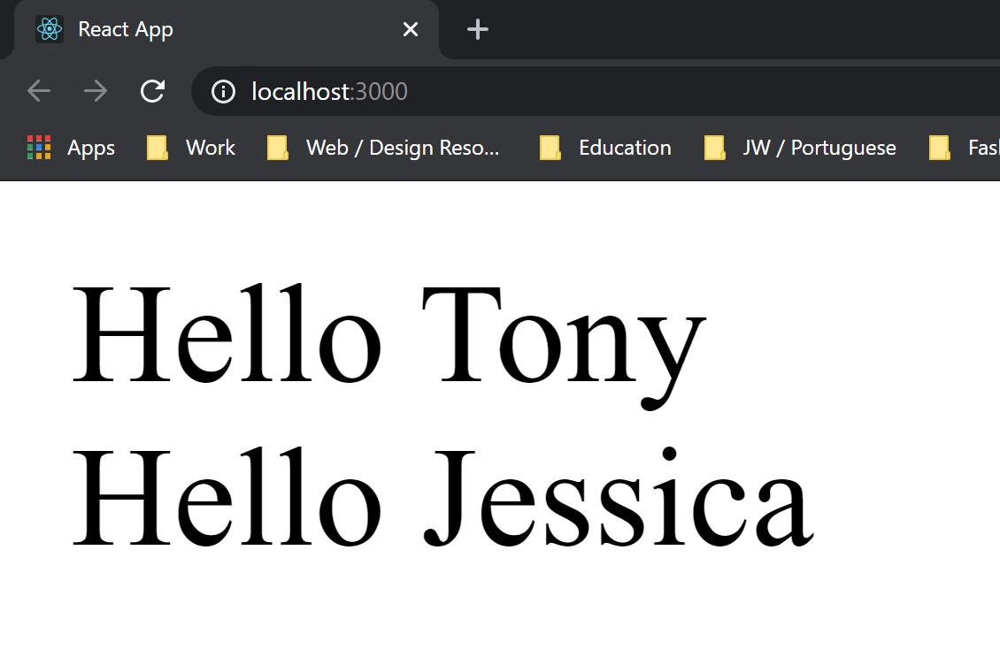
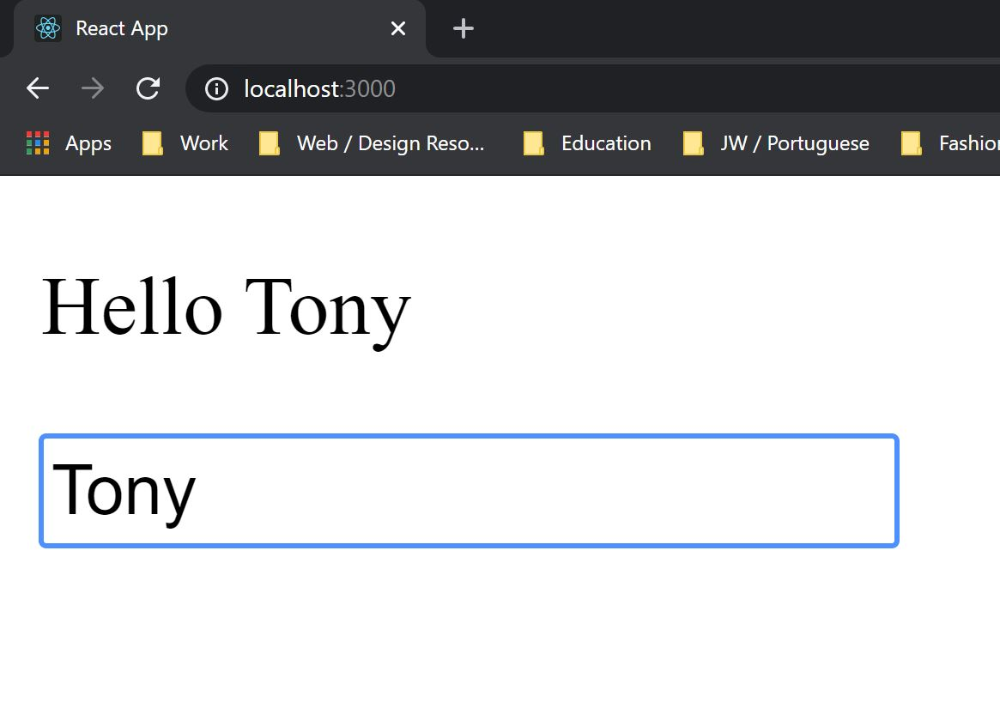

Welcome back! You may remember that last time, we discussed how we set up a ReactJS app, and what different parts of your initial app do. We also went through how to start viewing your React app, and how we can use components. If you haven't seen that article yet, you might want to [catch up with us](https://www.blog.tonycre8.co.uk/learning-reactjs-part-1/).

From the time between this article and the last article, I have been experiementing a little more with React and using APIs (which we may cover in a later article). It's still in the works at the moment, but I am very excited to reveal it when it's closer to completion.

So without further adieu, let's cover a couple more React concepts.

# Props vs States

The big one for the day - props and states. For beginners, there's a bit of confusion as to what these are and what the difference is. So first, let's cover **what they are**.

**Props** is shorthand for "property". If you know anything about programming, you'll know that properties can be attributed to something like an object or a class. As the typical example goes, a person (object) has a name, hair colour, eye colour, gender, etc - all properties of the person. This is good if you have predefined objects that you want to use, as props are set to read-only. Remember that, because it's important - **Props are read-only**, you cannot modify them outside of their initial definition.

**State** then, is a more versatile item. State is something that can be modified and rerendered through the program. A typical example of state is the [React counter](https://codepen.io/darylw/pen/vzKQNp?editors=0010), which was actually my first introduction to how React works. Essentially, we can modify the object in real time, without having to refresh the page. We can change the state by using ```setState()```. As we'll get into later, we can also extend our app by including ```useState()```, which lets us add states to function components. So remember for this one - unlike props, **state can be modified**.

So when would we use either of the two? Well, let's consider an example of how we use each.

## Using Props

You know how in the [last article](https://www.blog.tonycre8.co.uk/learning-reactjs-part-1/), we had our "my-first-app" example? Well, we're going to be going back to that, and making a few changes!

Firstly, we're going to change HelloWorld into HelloPerson, which is going to be in our components folder. We'll be working with the App.js, and the HelloPerson.js for today. In our App.js, we'll have something that looks a little like this:
```jsx
import React from 'react';
import './App.css';

import HelloPerson from './components/HelloPerson';

function App() {
  return (
    <>
      <HelloPerson name="Tony" />
    </>
  );
}

export default App;
```
Notice that in our app, we render this:
```jsx
<>
    <HelloPerson name="Tony" />
</>
```
Now from last time, we can recall that "HelloPerson" is a component, but what about this ```name={name}``` insertion? Well for that, we need to understand what's in the component's code (HelloPerson.js).
```jsx
import React from 'react'


class HelloPerson extends React.Component {
    render() {
    return (
        <div>
            Hello {this.props.name}
        </div>
    )
    }
}
export default HelloPerson;
```
We can see here that we render "Hello" and then ```{this.props.name}```. I think you can already guess as to what this means. If not, I'll break it down for you. The curly braces refer to an **object**. Which we'll talk more about another time. The "this" statement, is just referring to this element. So when we passed down the name in the App.js, it's just making sure we grab *that* name. And the name is well, the name that we passed through. We can prove this is the case, by adding another ```<HelloPerson>``` in our App.js, with a name equal to something like "Jessica". So our App.js render now looks like this:
```jsx
<>
    <HelloPerson name="Tony" />
    <HelloPerson name="Jessica" />
</>
```
And what do we get as a result? Let's run the app and see...



**BOOM!** We rendered the same component, but with different props. You can view this code in a [CodePen I made](https://codepen.io/tonycre8/pen/gObJPzp).

Mind you, we wouldn't be able to modify those props within the component. We'd only be able to set the prop outside of the component. For example, we may pass a const like so:
```jsx
const name = "Tony";

function App() {
  return (
    <>
      <HelloPerson name={name} />
    </>
  );
}
```

However, I'm not sure this the proper way of doing things. We're also getting a little ahead of ourselves - "What's a 'const'?". Let's take a quick moment to look at that.

> Const is shorthand for "Constant". It's the declaration of a variable, of which it's value won't change.

We'll discuss the other types of variable declarations another time in more detail though.

Now that that's cleared up, let's take a look at using state.

## Using state

Let's use the same example as before, but modify it a little - we're going to make dynamic name changing.
We can start by making a small change to the App.js render, like so:

```jsx
function App() {
  return (
    <>
      <HelloPerson />
    </>
  );
}
```
Note that this time, we don't have to pass anything through the component - nice!
We can then set up a constructor in our HelloPerson component, which looks a little like this:
```jsx
constructor(props) {
        super(props);
        this.state = {
            name: ""
        }
    }
```
We're going to be leaving our name blank for the moment. Why? Because we can manipulate state of course! Therefore, we're going to implement a little input box, that'll allow us to see how state can dynamically change a web page. So, let's add that to our render, like so:
```jsx
render() {
  return (
    <>
      <p>Hello {this.state.name}</p>
      <input type="text" onChange={this.updateName} />
    </>
  )
}
```
We use ```{this.state.name}``` that we defined in the constructor. But there's a couple missing pieces - what's ```onChange```, and what's ```this.updateName```? Well, ```onChange``` is known as a "handling event", that constantly updates when the value updates. If you're typing the letters of the name "Tom" for example, the value will update from "T", to "To", to "Tom" (Bad example I know). But we'll cover handling events in more detail in another article. And ```this.updateName```? that's a function that we've added to our class! The function is called updateName, and we just add the "this" keyword in front to let the app know we're running this for said element. I placed it above our render function, and it looks like this:
```jsx
updateName = (event) => {
  const newName = event.target.value;
  event.preventDefault();
  this.setState({
      name: newName
  })
}
```
We first pass through the event, which refers to the input element. By getting the ```{event.target.value}``` i.e. the value of what's in our input box, we can assign that to a const for easier reading. We then do an ```event.preventDefault()```, just to error handle the input a little bit (If you've got some JavaScript knowledge, you should know about this). After which, we call ```this.setState({})```, which will allow us to modify the state property. Then we just set the name equal to the newName that we enter in the input box.

And what do you get after all that? Something that looks like this:



And this works with whatever name you put in it, you can give it a try on [this little CodePen I setup](https://codepen.io/tonycre8/pen/oNgRjyE) to demonstrate.

## Wrapping up!

Wowie, I said last time that I'd cover a couple more topics. However, it seems we lack the page space. I mean, we don't but, breaking it up is easier for you to read, and better for me to take time and understand the concepts more accurately.

So what have we discussed today?

- What is a prop
- What is a state
- An example of a prop within an App
- An example of a state within an App

What will we cover next time?

- Functions vs Classes (main objective)
- Different variable types

I want to keep this material as bitesized as possible, whilst keeping accuracy and depth. So I don't want to cover too many topics if I have to skip details to keep them bitesized.

If there is anything in this article that is incorrect, or if there's anything I can add, please let me know! I'm writing these mainly for the sake of helping myself learn and understand these concepts. Therefore, accuracy is what I strive for with my understanding. I'll update this article if anything needs changing.