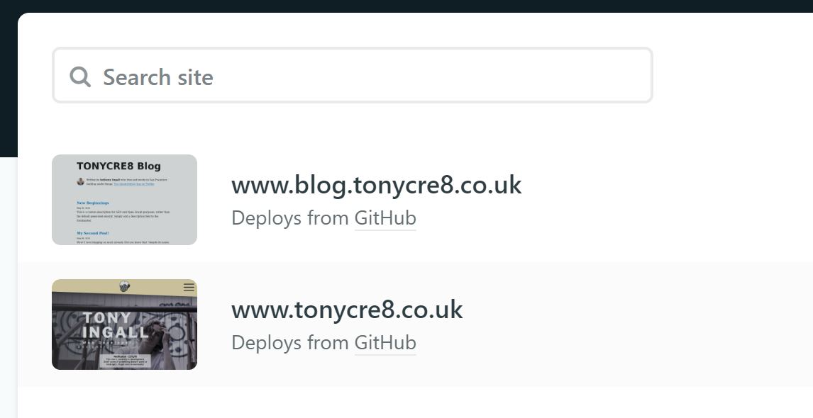
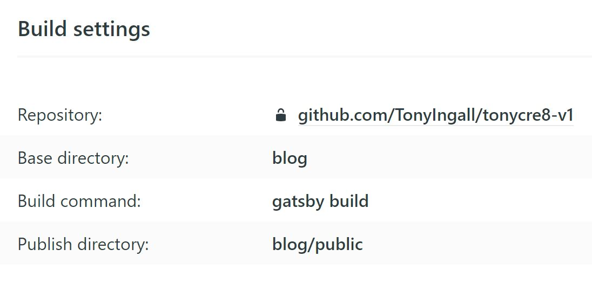

You probably have a couple questions if you're new to this (like me):
- What's a "monorepo"?
- What's a "Netlify"?
Don't worry, I'll quickly answer both of those.

#### Monorepo

A "monorepo" is a singular Git repository that is used to host multiple parts of a larger project. For example, this blog is part of a monorepo. [The main site](https://www.tonycre8.co.uk) and this blog are two parts of my project - a digital portfolio.

#### Netlify

Netlify is a service that will take a git repository and host it for you! My project is hosted on GitHub, and hooking the two of them up is quite easy to do. If you're not familiar with setting a Netlify site up, my brother wrote an article on [how to host a website with Netlify](https://ingalless.com/free-hosting-with-netlify).

With that quickly out of the way, how do we set things up?

## Setting your monorepo project up

First, let's talk about file structure. When we're talking about a monorepo, we're talking about multiple sites/apps within a project file. Now, my project isn't exactly set up this but (and you can do organisation however you like), but good practise is generically:
```
project
↳ main site
  ↳ files...
↳ some app
  ↳ files...
↳ a blog maybe?
  ↳ files...
↳ misc global files
```
By storing our sites/apps in seperate folders, we can easily split them apart for one. But also, we can use this structure to tell Netlify which sites are  which!

### This just in - Netlify

Netlify allows us to deploy the parts of our projects as seperate "sites". Essentially, with our file structure before, we can deploy our "main site", "some app" and "a blog maybe?" as seperate sites.
Here's an example of how my blog and website are separated.

>Multiple sites, all relating to one project.

We've got the main website, [www.tonycre8.co.uk](https://www.tonycre8.co.uk) as its own site. But we also have the blog as its own seperate site (the one you're on now!).

Note: It's easier to set these up using subdomains, as all you have to do is point the subdomain to specific "site" (i.e. blog.tonycre8.co.uk pointed to blog site, tonycre8.co.uk pointed to main site).

"But-" I hear you ask, "How do you split them from there?". The answer my friends, is **build settings**.

> Build settings for Blog site.

As you can see, the build settings for this blog *starts* in the main repository. However, this site starts its build from the blog folder.

**One repository, multiple projects. Monorepo? Bingo!**

When deploying the site with git, you can also insert into your project a ```netlify.toml```, and configure it with the attribute ```build.ignore``` to ignore certain folders i.e. the other sites. Although this can be ignored, it's probably best if you want a more efficient monorepo system.

### That should be it!

Everything you need to know should be in this article. If it isn't however, you can take a look at [Netlify's documentation](https://https://www.netlify.com/blog/2019/10/09/launching-monorepo-support-for-netlify-sites/) to get a better understanding.