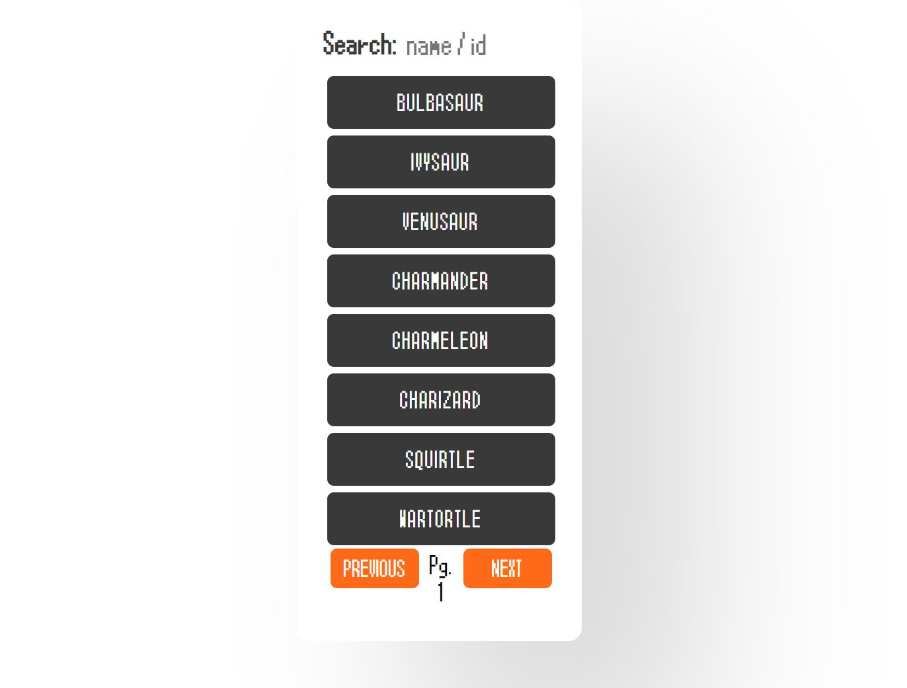
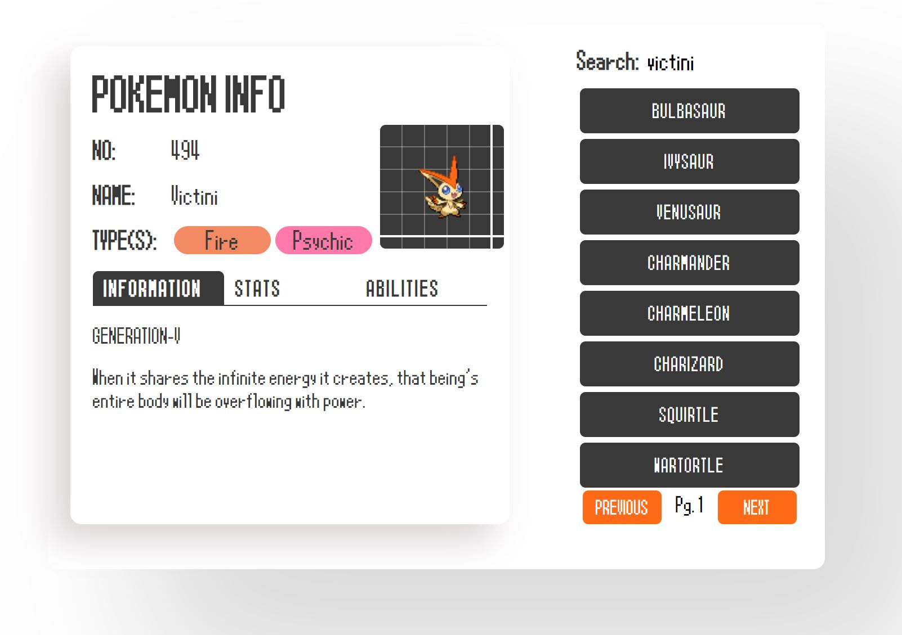

Good morning, afternoon, or evening depending on when you read this. If you're a reader of my blog, you'll know that I've recently been documenting my learning of ReactJS. Now, a lot of my learning has been me tampering with a project file, and constantly trying new things. However, this little gem of mine was a challenge set to me by my older sibling (an actual developer). The challenge was this: Use ReactJS, and the [PokeAPI](http://pokeapi.co/), to create an online Pokedex (you know, like the ones in the show and games).

Sounds simple enough, although very daunting for someone who hardly knows React, let alone how APIs work. Luckily I got a couple pointers, mainly on how to use React `useState()` and `useEffect()`, coupled with fetch requests.

So, I'd like to take the time in this article to show off a little of what I learned, and bits of how my project works. Although I can't say that it's avaliable for you to play around with yet, as I still want to expand parts of it to contain as much relavent information as possible.

### Let's quickly go over the objectives

Other than creating a functional Pokedex, I have a few little objectives I want to complete with this project.

One of these, is to create an online Pokedex, that *looks* like a Pokedex. When looking around at other uses of this API, I saw that not many took the approach to mimick the design of a Pokedex. I decided I wanted to take this in stride, and produce a Pokemon app that not only functioned like a Pokedex, but felt like a Pokedex too. My inspiration for my design was the Pokedex from generation 5's "Pokemon Black and White", as this line of games was honestly my favourite. As such, I'm also giving this project the working title of **VictiniDex**, as Victini is one of my favourite mythical 'mons, and his colours have been taken to use in the app's colour scheme.

Another objective of mine, in a similar vein to the Pokedex design, is to include information that would actually be displayed on an ingame Pokedex. This not only simplifies the job for me, but there's also *so much* data on any singular Pokemon through this API, and I didn't want my app to become too cluttered. For all the details, maybe take a look at something like [Bulbapedia](https://bulbapedia.bulbagarden.net/wiki/List_of_Pok%C3%A9mon_by_National_Pok%C3%A9dex_number).

## The beginnings - get the data

To start out with, we have one main objective: to get a set of Pokemon and list them. We can handle this via our fetch request in a `useEffect()` hook. And I made a little change to the default query to make it much easier to handle for later.

```js
useEffect(() => {
    fetch
    (`https://pokeapi.co/api/v2/pokemon/?offset=${offset}&limit=8`)
    .then(res => res.json())
    .then((data) => {
        const {results, ...pageData} = data
        setCurrentPageDetails(pageData)
        setPokemon(results)
    })
    .catch(console.log)
}, [page])
```

Essentially, if we were to make a default query to the API (`.../api/v2/pokemon/`), it'll automatically grab us the first 20 Pokemon. However, my design doesn't work well with that amount of Pokemon, as I need to make sure things *look pretty*. So, I set the limit value of the link to 8. But you notice that before that, there's an offset too. But this offset is set to `${offset}`, which is us inserting a variable into the string. Why do we do this? Easy, it's to make page changes a lot easier:

```js
const handleNextPage = (nextPage) => {
    if (nextPage) {
        setOffset(offset + 8);
        setPage(page + 1);
    }
}
```

So in this function (that I've attached to a next page button) we update the offset value, as well as the page value. What does the page value do? Well, other than displaying the current page number, did you see "page" being mentioned in the fetch that we ran earlier? A little hint: It's right at the bottom of that first snippet. That is how we tell our fetch query **when** to update our changes. So, we update the value of our offset, we then change the page number, and a new fetch triggers because of that new page number, and grabs the new data using the offset value.

Then, after we grab our link, we run two `.then()` statements, that looks like this:

```jsx 
.then(res => res.json())
.then((data) => {
    // Code here
}).catch(console.log)
```

Essentially what these statements do, is take the data we fetched, and turn it into JSON data, which we can then work with.

Notice how, when the fetch is successful (after the two `.then()` statements), we then call this:

```js
// .then stuff
{
    const {results, ...pageData} = data
    setCurrentPageDetails(pageData)
    setPokemon(results)
})
```

Now, let's quickly break this down: When we are definining that const, we are performing something known as **object destructuring**. So when we call to the API initially, we'll get something like this:

```json
{
    "count":964,
    "next":"https://pokeapi.co/api/v2/pokemon/?offset=0&limit=4",
    "previous":null,
    "results": [
        {
            "name":"bulbasaur",
            "url":"https://pokeapi.co/api/v2/pokemon/1/"
            },
        {
            "name":"ivysaur",
            "url":"https://pokeapi.co/api/v2/pokemon/2/"
            },
        {
            "name":"venusaur",
            "url":"https://pokeapi.co/api/v2/pokemon/3/"
            },
        {
            "name":"charmander",
            "url":"https://pokeapi.co/api/v2/pokemon/4/"
            }
    ]
}
```

See how when we destructure this query object, we label two things: `results`, and `pageData`. Now, there isn't a `pageData` value in our JSON query, but there is a `results` value. The results return an array of objects. So we split our results, and add an ellipsis to then ***Scyther*** (*get it? sounds like siphon*) off the other data to store in a different value. Then we call two functions: `setCurrentPageDetails(pageData)` and `setPokemon(results)`. What are these methods?

### We've got our lists, so let's list our items!

> Or, if you'll humour me, *catch our Pokemon*.

I've avoided mentioning something up until this point, that I talked about in the beginning of this post. `useState()`. It's the answer to these issues.

```js
import React, { useEffect, useState } from 'react';
...
// In "function App() {}":
const [pokemon, setPokemon] = useState([]);
const [currentPageDetails, setCurrentPageDetails] = useState();
```

So we have these two constants, that are stored in square brackets. The first value, is well, *the value*. It's the main thing we'll be calling when we want to display information. As an example, if we had a useState for our name and we wanted to display it, we would call `{name}`. However, there's also a second value - `setPokemon`. This is less of a value, and rather a *method in order to set our value*. So if we wanted to change Pokemon (or in our simplified example, change names), we'd get some value to put in, and then use `setName(value)` in our code. 

Now you notice that in our first useState, we open and close braces but also add some square brackets in - this is because we're storing multiple pieces of information about a Pokemon in there. Remember when we called the API and the results came back? Each Pokemon had both a **name** and a **url** to a different part of the API.

Setting our Pokemon from that query, allows us to display our list of Pokemon on the page. In our function's return, we call:

```jsx
return (
    <div className="app">
        {/*Other jsx we'll cover later...*/}
        <ul className="list">
        {pokemon.map(poke => <li><button onClick={() => 
        getDetails(poke.url)}>{poke.name}</button></li>)}
        </ul>
        {/*Our next and previous page controls...*/}
    </div>
);
```

Now you can see, we run an function called `map()` on our Pokemon value. What this allows us to do is to split the array, and say for every result we have, do something. The something that we are doing this time round is this: For every Pokemon (or Poke) in our list of Pokemon (the terms are confusing), we are creating buttons with the singular Pokemon's name on it, with an onClick method of `getDetails(poke.url)` to get said Pokemon's information.

So, let me show you what that all looks like in view:



Now, that `onClick()` event? That's how we're going to get our Pokemon's information, and then we'll have a chance at creating a component to handle the display of the Pokemon's data. I know, it takes a lot to get to that point.

## Finally, some good data!

So, with all that. We now have to create a component to handle our Pokemon data, as well as defining what happens in `getDetails()`. So, before I forget, let me drop this part of the main app jsx here:

```jsx
<div>
    <Pokedex pokemonUrl={pokemonUrl}/>
</div>
```

Now there's a new value, pokemonUrl. It is another `useEffect()` that I totally forgot to mention to you. It has the value of `pokemonUrl`, and the set method of `setPokemonUrl()`. So, when we click on a Pokemon's name, we `getDetails` of `poke.url`. And our onClick event runs as such:

```jsx
const getDetails = (pokemonUrl) => {
    setPokemonUrl(pokemonUrl);
}
```

Ah, there it is. We set our url equal to our passed through url for the Pokemon. So at this point you may think "Wait, we haven't actually done anything with that information, have we?" And you're right, we haven't. That's why we need a new component. We'll call it `pokedex.js`.

## Almost there...

Now to start out with, we need to run through our useEffect yet again. But it's vital, there's a very important part of this hook that is a make or break with our app.

```jsx
export default function Pokedex({ pokemonUrl }) {
    const [pokemonInfo, setPokemonInfo] = useState();
    // Some other consts we'll cover later...
    useEffect( () => {
        if (pokemonUrl) {
            fetch(pokemonUrl)
            .then(res => res.json())
            .then((data) => {
                setPokemonInfo(data)
            })
            .catch(console.log)
        }
    }, [pokemonUrl] )
    
    // ...
}
```

Now notice, our function *requires* the Pokemon url object to work. Also, at the bottom of our fetch, we will refetch the data when the Pokemon url **changes**.

Essentially, **that's it!** If you were to fetch the value of, let's say Victini (You know, the Pokemon I used to name and theme this Pokedex skin), we would recieve this load of information:

```json
{
    "abilities": [{
        ...
    }],
    "base_experience": 270,
    "forms": [{
        ...
    }],
    "game_indices": [{
        ...
    }],
    "height": 4,
    "held_items": [],
    "id": 494,
    "is_default": true,
    "location_area_encounters": ...,
    "moves": [{
        ...
    }],
    "name": "victini",
    "order": 585,
    "species": {
        ...
    },
    "sprites": {
        ...
    },
    "stats": [{
        ...
    }],
    "types": [{
        ...
    }],
    "weight": 40
}
```

Now if you think this looks long, I had to cull roughly 3000 lines to simplify this query's results (mostly of just different teachable moves). With that sorted, we can now start to look at how to display all this nicely, as well as some extra other bits.

# But...

That's going to have to be something for another article! This post is quite lengthy as is. Plus, as I'm already starting to run out of ideas, I can just prolong articles in order to give me more of a chance to think of some more interesting topics (if this wasn't interesting enough for you).

Please, *please*, **PLEASE** let me know of what you thought of this article, as it helps me to grow not only as a writer, but as a developer too! You can let me know on my Twitter, [@TONYCRE8](https://twitter.com/TONYCRE8) (Or you can just follow me anyways now that you're here, that works too).

As a parting note though, I will show you what the app currently looks like (you'd know already if you followed my Twitter, fyi):

